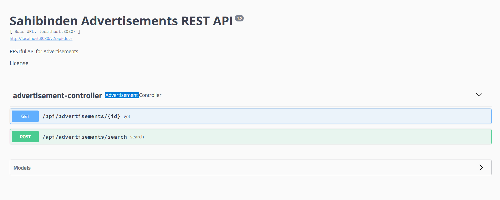
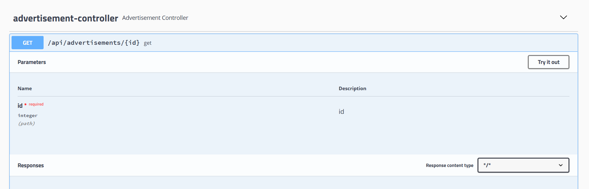
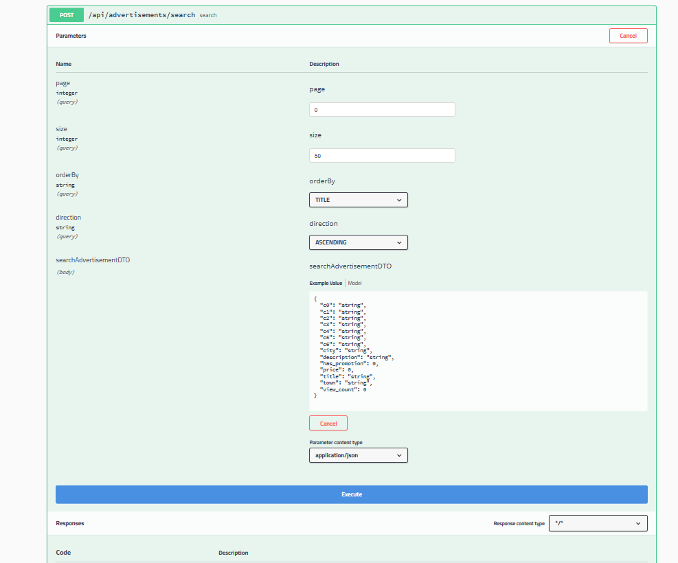

## Dev Akademi 2019 Projesi

* Bu projede Spring Boot ile Rest API yazdım.
* Database olarak h2 in-memory database kullandım.
* Dökümantasyon için ve testlerinin daha kolay yapılabilmesi için Swagger kullandım.
* Swagger ile Google Chrome tarayıcısından request atamadım. Bu yüzden Micorosof Edge ile test ettim. Siz de test ederken Google Chrome da çalışmazsa Başka bir taracıda deneyebilirsiniz.
* Test için Postman da kullanabilirsiniz.
# Nasıl Çalışır ?

* Programı çalıştırmaya başladığınızda veriler databas'e yüklenir. Bu biraz zaman alabilir.
* Verilerin database e yüklenmesi bittikten sonra tarayıcınızdan http://localhost:8080/swagger-ui.html#/ 
adresine giderseniz karşınıza gelen arayüzden "advertisement-controller" a tıklamanız gerekmektedir. 
* Tıkladıktan sonra karşınıza aşağıdaki gibi bir arayüz gelecek.

* Bu arayüzde görüldüğü üzere GET ve SEARCH metorlarını test edebilirsiniz.
* GET metodunu test etmek için üzerine tıklamanız gerekmektedir. Tıkladıktan sonra karşınıza aşağıdaki gibi bir arayüz gelecek.

* Bu arayüzden Try it out a tıklarsanız bu metodu deneyebilirsiniz. Bu metot parametre olarak id alır ve eğer databasede o girilen id de reklam varsa size json olarak döndürür. Eğer yoksa NOT_FOUND döner.

* Searh Metodunu test etmek için Search metdouna tıkladıktan sonra Try it out a tıkladıktan sonra karşınıza aşağıdaki gibi bir arayüz gelecek.

* Burada ki page parametresine hangi sayfanın gelmesini istiyorsanız onu girmeniz gerekmektedir. Default olarak ilk sayfa gelir.
* Size parametresine 1 sayfada bulunan maximum veri sayısı girilmelidir. Default olarak 50 dir.
* OrderBy parametresine gelen verilerin hangi özelliğe göre sıralanmasını istiyorsanız onu girmelisiniz. Default olarak title a göre sıralı gelir.
* Direction kısmına sıralamanın artan mı azalan mı olduğunu girmelisiniz.
* Parametre olarak verilecek JSON un body sine hangi özelliğe göre ne aramak istiyorsanız onu girmelisiniz.
* Eğer JSON boş olursa bütün veriler gelir. Tabi sayfa büyüklüğü kadar.
 

